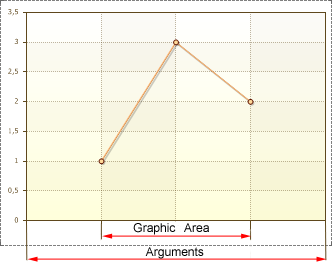
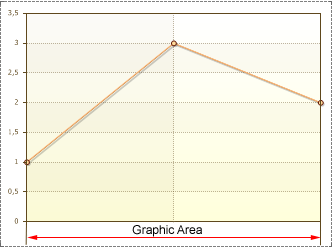

## StartFromZero Property

By default, the **Start from Zero** property is set to **true**. Arguments are shown from the start to the end, regardless of the location of the chart. The picture below shows an example of a chart with the **Start from Zero** property set to **true** for the X and Y axes:

If the **Start from Zero** property to set **false**, then the Range of the chart area will be shown. The picture below shows an example of a chart with the **Start from Zero** property set to **false** for the X axis:

