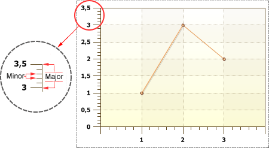
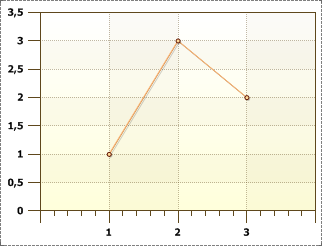

## Minor

**Minor ticks** show the proportion of a single axis segment. **Minors ticks** have the following properties: **MinorCount**, **MinorLength**, **MinorVisible**.

* **Minor Count** is used to change the number of Minor ticks. The value of this property can be any positive number or 0. The distance between two nearest Major ticks is divided into the number of Minor ticks into equal parts. The picture below shows an example of a chart, with the **Minor Count** property set to 4 for X and Y axes:

* **Minor Length** is used to change the length of Minor ticks. The value of this property can be any positive number greater than 0, the field of this property can not be left blank. The length of Minor ticks can be longer than the length of Minor ticks.

* **Minor Visible** is used to show/hide Minor ticks on axes. If the **Minor Visible** property is set to **false**, then the Minor ticks are hidden. If the value of this property is set to **true**, then the Minor ticks are shown. The picture below shows an example of a chart, with the **Minor Visible** property set to **true** for X axis, and set to **false** for Y axis:

By default, the **Minor Visible** property is set to **false**.
