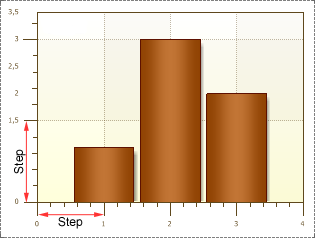

## Step Property

The **Step** property is used to change the step between Ticks, the distance between neighbor Major ticks. By default, the value of the **Step** property is set to 0. The picture below shows an example of a chart with the Step is installed to the 0 default value.

As one can see, if the value is 0, then the distance between two between neighbor Major ticks by the Y axis is **0.5**, and **1** by the X-axis. If to set the Step property to **Z** value, then the report generator will multiply **Z** value by the value of the unit interval. The result obtained is the distance between two neighbor Major ticks. The picture below shows an example of a chart, with the step on the Y axis set to **1,5**, and the X axis value set to **1**:

