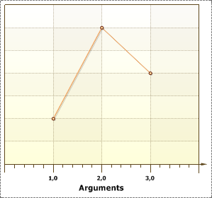
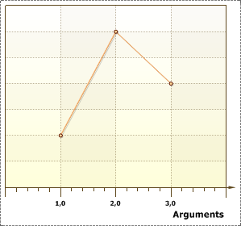
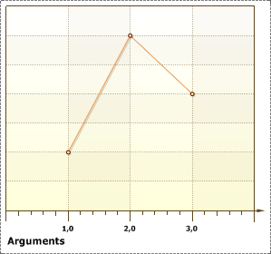

## Alignment Property

The **Alignment** property is used to align a title of an axis. The full path to this property is **Area.Axes.Title.Alignment**. This property has the following values: **Center**, **Far**, **Near**.

* **Center**. Aligns the title of the axis by center by the axis. The picture below shows an example of a chart, with the **Alignment** property of a title of the X axis set to **Center**:

* **Far**. Aligns the title of the axis on the opposite side from origin of coordinates. The picture below shows an example of a chart, with the **Alignment** property of a title of the X axis set to **Far**:

* **Near**. Aligns the title of the axis on the near the origin of coordinates. The picture below shows an example of a chart, with the **Alignment** property of a title of the X axis set to **Near**:

By default, the **Alignment** property of series is set to **Center**.
