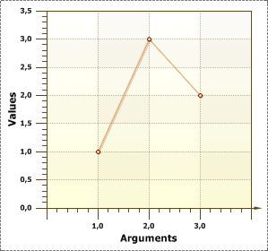

## Title Property

The **Title** property is a title of axis. This property is used to display an axis title. Moreover, the **Title** property for each axis is given separately. The picture below shows a chart where the **X** axis is called the "**Arguments**", and the axis **Y** is called "**Values**":

Also, the **Title** property has the following properties:

 **Alignment** is used to align the **Title**. It has the following values **Center** (align center), **Far** (align from the beginning of an axis), **Near** (align to the beginning of an axis);

 **Antialiasing** is used to produce smooth-edged **Titles**;

 **Color** is used to change a title text of an axis;

 **Font** is used to change the size, font style of a title text of an axis;

 **Text** is a field to type a title text of an axis. If the field is empty then the title of an axis is not displayed.
