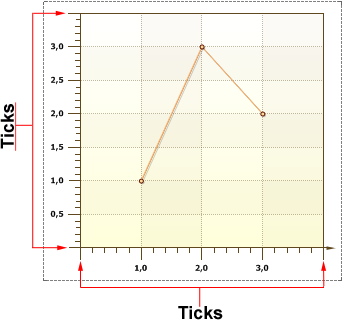

## Ticks

**Ticks** are horizontal (for the Y axis) and vertical (for the X axis) lines, which visually show the unit interval and the proportion of segments. Under the **Ticks** labels are displayed. The picture below shows a chart with ticks:

Ticks have the following properties:

 **Length** is the length of ticks, under which Labels are placed;

 **Minor Count** allows changing the number of intermediate lines (Minor ticks);

 **Minor Length** is the length of the intermediate lines (Minor ticks);

 **Minor Visible** is used to show/hide the intermediate lines (Minor ticks);

 **Step** controls the step of the unit interval, distance between ticks;

 **Visible** is used to show/hide **Ticks**, both basic and intermediate.
