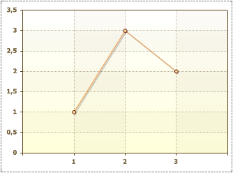
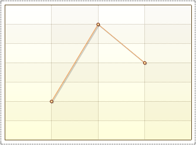
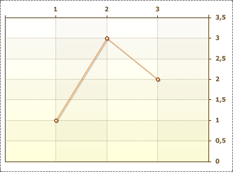

## Visible Property

The Visible property is used to show X and Y axes. The picture below shows a chart with the Visibility property set to true (axes are visible):

If the Visible property is to set the false, then X and Y axes will not be shown. The picture below shows this:

The Visible property has the X axis and the Y axis. It is possible to hide/show axes separately. Also, this property is used to display the top X axis and right Y axis. By default, for the axes, the property is set to false. The picture below shows an example of a chart, to display the top X axis and the right Y axis:

The Visible property has the top X axis and the right Y axis. It is possible a combination, for example, the top X axis and the left Y axis or the X axis and right Y axis or any other combinations.

By default the Visible property is set to true.
