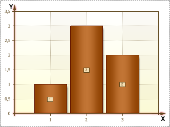
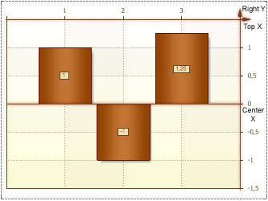

## Axes

Axes Area has Х and Y axes. The Х axis, as a rule, is the axis of arguments, and the Y axis, is the axis of values.

Besides, the Axes Area can contain top and central Х axis, and right Y axis.

