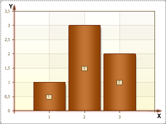
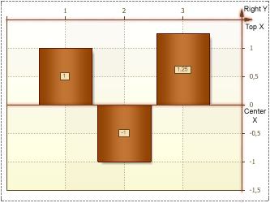

## Axes

**Axes Area** has **X** and **Y** axes. The X axis, as a rule, is the axis of arguments, and the Y axis, is the axis of values.

Besides, the **Axes Area** can contain top and central **X** axis, and right **Y** axis.

