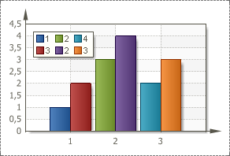

## ColorEach Property

The **Color Each** property is used (depends on the selected style) to set color for each value of a series. By default, the **Color Each** property is set to **false**, columns of one row have the same color. The picture below shows an example of a chart with the **Color Each** property set to **false** for two series:

If the **Color Each** property is set to true, then each value of X axis has its own color. The picture below shows an example of a chart with the **Color Each** property set to **true** for two series:

