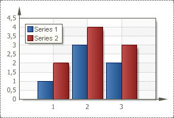
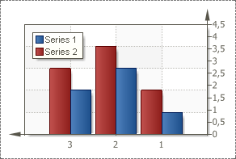

## ReverseHorizontal Property

The **Reverse Horizontal** property is used to flip a chart horizontally. The picture below shows an example of a chart, with the Reverse Horizontal property set to false (As one can see, the values of the x-axis have left to right direction.):

If the **Reverse Horizontal** property is set to **true**, then the chart will appear in the opposite direction horizontally. The picture below shows an example of a chart, with the Reverse Horizontal property is set to true (As one can see, the values of the x-axis have right to left direction.):

By default, the **Reverse Horizontal** property is set to **false**.
