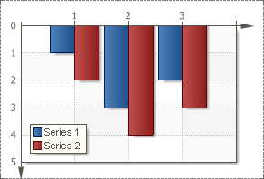

## ReverseVertical Property

The **Reverse Vertical** property is used to flip a chart vertically. The picture below shows an example of a chart, with the **Reverse Vertical** property set to **false** (As one can see, the values of the x-axis have normal direction.):

If the **Reverse Vertical** property is set to **true**, then the chart will appear in the opposite direction vertically. The picture below shows an example of a chart, with the **Reverse Vertical** property is set to **true** (As one can see, the values of the x-axis have downright direction.):

By default, the **Reverse Vertical** property is set to **false**.
