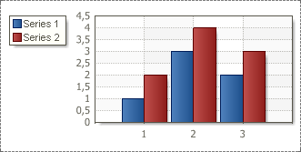
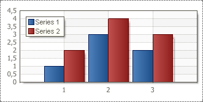
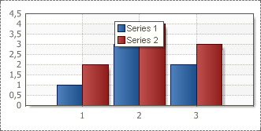
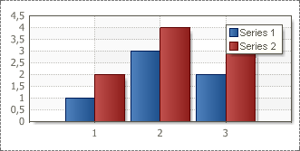
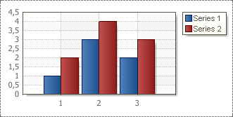

## HorizontalAlignment Property

The **HorizontalAlignment** property of the Legend allows aligning the Legend position horizontally. The full path to this property is **Legend.HorizontalAlignment.** The property has the following values: **Left Out Side**, **Left**, **Center**, **Right**, **Right Out Side**.

Description of values:

* **Left Out Side**. The legend will be placed outside the Chart area on the left. The picture below shows where the Legend will be placed if the **Horizontal Alignment** property is set to **Left Out Side**:

* **Left**. The legend will be placed inside the Chart area on the left. The picture below shows where the Legend will be placed if the **Horizontal Alignment** property is set to **Left**:

* **Center.** The legend will be placed inside the Chart area in the center. The picture below shows where the Legend will be placed if the **Horizontal Alignment** property is set to **Center**:

* **Right**. The legend will be placed inside the Chart area on the right. The picture below shows where the Legend will be placed if the **Horizontal Alignment** property is set to **Right**:

* **Right Out Side**. The legend will be placed out side the Chart area on the right. The picture below shows where the Legend will be placed if the **Horizontal Alignment** property is set to **Right Out Side**:

By default the **HorizontalAlignment** property is set to **Left**.
