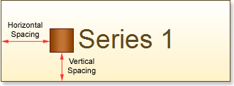

## Horizontal Spacing and Vertical Spacing Properties

The Horizontal Spacing and Vertical Spacing properties allow setting the spacing (horizontal and vertical, respectively) between the Legend edge and the information on series. The full paths to these properties is Legend.HorizontalSpacing and Legend.VerticalSpacing. The picture below shows in arrows the horizontal and vertical spacing between the Legend edge and the Series 1:

These properties can take numeric values, and are required for filling. If values of the Horizontal Spacing and Vertical Spacing properties are negative, then the legend can be unreadable. The minimum value of these properties is 0.
