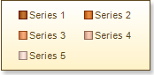

## Columns Property

The **Columns** property allows changing the number of columns vertically or horizontally depending on the value of the **Direction** property. The full path to this property is **Legend.Columns**. The picture below shows a sample of the Legend which markers are split into two horizontal columns (the **Direction** property is set to **Top to Bottom**):

If to set the **Columns** property to **2**, and set the **Direction** property to **Left to Right**, then markers will be split into two vertical columns. The picture below shows a sample of the Legend which markers are split into two vertical columns (the **Direction** property is set to **Left to Right**):

The **Columns** property may have any values more than **0**. This property must be set. It cannot be left empty.
