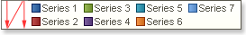
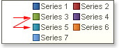
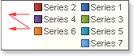

## Direction Property

The Direction allows selecting the order of showing markers. The full path to this property is Legend.Direction. The property has the following values: Top to Bottom,  Bottom to Top, Left to Right, Right to Left.

Description of values:

* Top to Bottom. Markers are shown in the "from top to bottom" order. The picture below shows a sample of the Legend which the Direction property is set to Top to Bottom:

* Bottom to Top. Markers are shown in the "from bottom to top" order. The picture below shows a sample of the Legend which the Direction property is set to Bottom to Top:

* Left to Right. Markers are shown in the "from left to right" order. The picture below shows a sample of the Legend which the Direction property is set to Left to Right:

* Right to Left. Markers are shown in the "from right to left" order. The picture below shows a sample of the Legend which the Direction property is set to Right to Left:

By default the Direction property is set to Top to Bottom.
