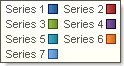

## Marker Alignment Property

The **Marker Alignment** property allows aligning markers either left or right from the "**Series**" name. The full path to this property is **Legend.Marker Alignment.** If the **Marker Alignment** property is set to **Left**, then the marker will be placed on the left from the "**series**" name. The picture below shows a sample of the Legend which the **Marker Alignment** property is set to **Left**:

If the **Marker Alignment** property is set to **Right**, then the marker will be placed on the right from the "**series**" name. The picture below shows a sample of the Legend which the **Marker Alignment** property is set to **Right**:

By default the **Marker Alignment** property is set to **Left**.
