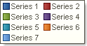
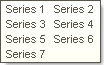

## MarkerVisible Property

The MarkerVisible property allows showing/hiding the legend markers. The full path to this property is Legend.MarkerVisible. If the MarkerVisible property is set to true, then markers are shown. The picture below shows a sample of the Legend which the MarkerVisible property is set to true:

If the MarkerVisible property is set to false, then the Legend markers are hidden. The picture below shows a sample of the Legend which the MarkerVisible property is set to false:

By default the MarkerVisible is set to true.
