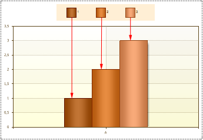

## Marker

The Marker is an icon that indicates the chart row. The number of markers correspond to the number of rows. On the picture below a sample of chart with three rows and markers for them is shown:

