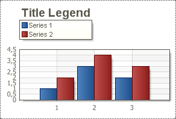

## Title Property

The **Title** property of the Legend allows setting the Legend title. The full path to this property is **Legend.Title**. If the field of the **Title** property is not filled then the Legend title is not shown. The **Title** is shown over the Legend. The picture below shows a sample of the Chart with Legend where the "Title Legend" is the Legend title:

The **Title** property has the following properties:

 **TitleColor** - sets the Title color;

 **TitleFont** - sets the Title font size and font style.
