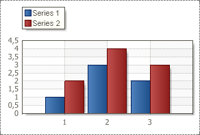
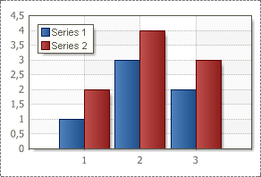
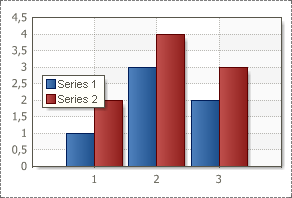
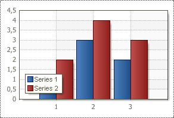
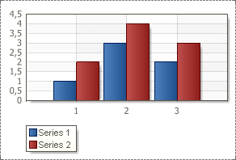

## VerticalAlignment Property

The **Vertical Alignment** property of the Legend allows aligning the Legend position vertically. The full path to this property is **Legend.VerticalAlignment.** The property has the following values: **Top Out Side**, **Top**, **Center**, **Bottom**, **Bottom Out Side**.

Description of values:

* **Top Out Side**. The legend will be placed above and outside the Chart area. The picture below shows where the Legend will be placed if the **Vertical Alignment** property is set to **Top Out Side**:

* **Top**. The legend will be placed inside the Chart area on the top. The picture below shows where the Legend will be placed if the **Vertical Alignment** property is set to **Top**:

* **Center**. The legend will be placed inside the Chart area and vertically in the center. The picture below shows where the Legend will be placed if the **Vertical Alignment** property is set to **Center**:

* **Bottom**. The legend will be placed inside the Chart area on the bottom. The picture below shows where the Legend will be placed if the **Vertical Alignment** property is set to **Bottom**:

* **Bottom Out Side**. The legend will be placed under and outside the Chart area. The picture below shows where the Legend will be placed if the **Vertical Alignment** property is set to **Bottom Out Side**:

By default the **Vertical Alignment** property is set to **Top**.
