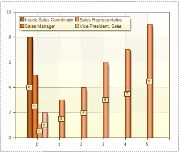
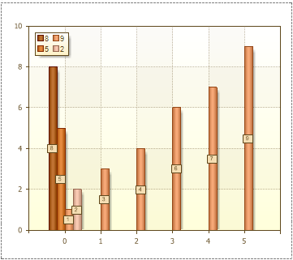

## AutoSeries

Stimulsoft Reports can automatically create a series. Use the **Auto Series Key Data Column**, **Auto Series Color Data Column**, and **Auto Series Title Data Column** properties. A column from which values are taken to build the series is selected in the **Auto Series Key Data Column** property. A series is created for each unique value. The picture below shows an example of a chart with the **Auto Series Key Data Column** property set to **Employees.Title**:

There are 4 rows on the picture above. The 1st, 2nd, 4th series have one value, and the 3rd series has 6 values. This means that the **Employees** data source in the **Title** column contains **9** lines, and 6 lines have identical values (records), and the remaining three are different. Values (records) of rows in the data source are shown in a rendered chart in the legend, as well as the name of the series, if the field of the **Auto Series Title Data Column** property is empty. The **Auto Series Color Data Column** property is used to specify the color range, each series will have its own color. This property is subsidiary, and is not required to fill in the automatic creation of the series. Also, the subsidiary property and the **Auto Series Title Data Column** property, using what it is possible to change the title of the series. The picture below shows an example of a chart, with the **Auto Series Key Data Column** property set to **Employees.Title**, and the **Auto Series Title Data Column** property set to **Employees.EmployeeID**:

As seen from the picture above, the series labels are changed. As the series labels, string values are taken from the columns of the data source that is listed in the **Auto Series Title Data Column** property, in this case, this is the **EmployeeID** column.
