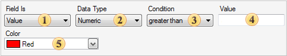

## Conditions

If it is necessary to set the color of values in a chart, one can specify the condition. The **Conditions** property in the **Series Editor** is used to set up conditional formatting. The editor of conditions is called using this property. The picture below shows the main elements of the editor of conditions:

 **Field Is**

This is used to select the type of conditions.

 **Data Type**

This field specifies the type of data with what a condition will work. There are five types of data: **String**, **Numeric**, **DateTime**, **Boolean**, **Expression**. Data type affects on how the reporting tool processes a condition. For example, if the data type is a string, then the methods of work with strings are used. In addition, depending on the type of data the list of available operations of conditions is changed. For example, only for the **String** data type the **Containing** operation is available**.** The **Expression** data type provides the ability to specify an expression instead of the second value. In this case the reporting tool will not check the compatibility of the first and the second values of the condition. Therefore, the user should care about the correctness of the expression.

 **Condition**

A type of operation using what the calculation of values will be done.

 **Value**

The first value of a condition.

 **Color**

Select a color to mark values which corresponds to condition.
