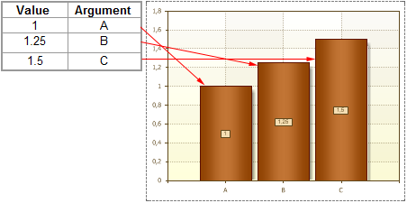

## Data Column

The **Value Data Column** and **Argument Data Column** properties are used to connect a series by specifying a data column from the dictionary. The reporting tool renders series of charts by values and arguments of the column selected in the fields of the **Value Data Column** and **Argument Data Column** properties. For example, if the selected column of data from the data source contains the 1000 values, then all the 1000 values will be used in constructing the chart. The picture below shows an example of the chart, so the values from the selected data source column:

