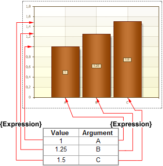

## Expressions

To connect a series of data using the expression, you should use the **Value** and **Argument** properties. The values of these properties are expressions, the result of their calculation is used to obtain a single value of data and argument of data. If you use the Value and Argument properties, then, for this chart, it is necessary to select a data source (the Data Source property), because expressions specified in the fields of these properties are not lists of data and return only one value when calculating. Moreover, the **Value** property returns the value in Number format, but the **Argument** property allows any type of data. To make the report generator know which list should be used for the report, it is necessary to indicate the data source. Once the data source is specified, the report generator runs through all the records of the data source and calculates all the values and arguments according to expressions given in the fields of the **Value** and **Argument** properties. The result of the calculation is used to create a chart. Also, for the data in the data source, you can specify sorting and filtering. The picture below shows an example of a chart, rendered on the basis of results of values and arguments calculations of the selected column of the data source:

