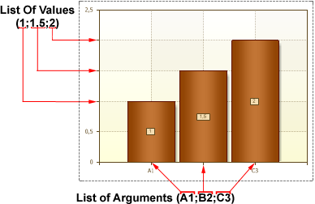

## List of Values Property

If it is necessary to build a chart by the given values and arguments, then one should use the **List of Values** and the **List of Arguments** properties. The **List of Values** indicates values for creating series (values must be entered through the **';'** separator). The **List of Arguments** property indicates arguments for creating series (values must be entered through the **';'** separator). The order number of the **List of Values** property values corresponds to order number of the **List of Arguments** property values. The picture below shows an example a chart, designed by the list of values and arguments:

