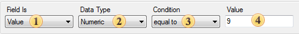

## Filters

Sometimes, in creating reports, it is necessary to print, not all values from the data source, but only those that meet specific criteria. To select the required settings, data filtering is used. Filtering is set using the **Filters** property in the **Series Editor**. A condition is specified is each filter. If the condition is **true**, the result of its calculation is **true**. This means that this value will be used when chart rendering. If the result of calculation of the filter condition is **false**, then this value will be ignored. Each filter represents a condition for processing the data values. The picture below shows an example the filter panel:

 The method of choosing the conditions by what filtering (Value or Argument) is done.

 This field specifies the type of data with what condition will be working. Five types of data are available: **String**, **Numeric**, **DateTime**, **Boolean**, **Expression**. The data type affects how the report generator processes the condition. For example, if the data type is a string, then the method of work with strings is used. In addition, depending on the type of data the list of available condition operations is changed. For example, only for the **String** data type the **Containing** operation is available. The **Expression** data type is used to set the expression instead of the second value.

 The type of operation with what it is possible to calculate a value of a condition. All available types of operations are available in the table below.

 Values of the filter condition.

A list of available operations depends on the type of data. Below is a table of operations for each type of data with their descriptions.

| **Operation** | **Types of data** | **Description** |
| --- | --- | --- |
| **String** | **Numerical** | **DateTime** |
| **equal to** |  |  |
| **not equal to** |  |  |
| **between** |  |  |
| **not between** |  |  |
| **greater than** |  |  |
| **greater than or equal to** |  |  |
| **less than** |  |  |
| **less then or equal to** |  |  |
| **containing** |  |  |
| **not containing** |  |  |
| **beginning with** |  |  |
| **ending with** |  |  |
