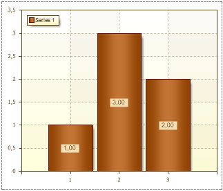
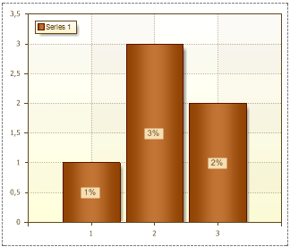
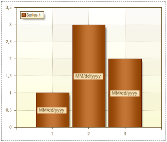

## Format Property

The Format property is used to format the contents of Series Labels. This property has multiple values.

* Number. The N value of the Format property is used for the general display of numbers. When filling the Format, after the N value, it is possible to specify the number of decimal places that you want to use. If no numbers are specified after N then decimal places will be shown only if they are present as a result of calculation. The picture below shows a chart with the Format property of Series Labels set to N:

* Currency. The C value of the Format property is used to display Series Labels with a currency symbol. After the C value, it is possible to specify the number of decimal places that you want to use. The picture below shows a chart with the Format property of Series Labels set to C:

* Percentage. The P value of the Format property is used to display Series Labels with percent symbol. After the P value, it is possible to specify the number of decimal places that you want to use. The picture below shows a chart with the Format property of Series Labels set to P:

* Date. The MM/dd/yyyy, MMMM dd, yyyy MMMM values of the Format property convert values of arguments to date. MM/dd/yyyy - the date is shown like "01.20.2010",  MMMM dd - the date is shown like "September 29", yyyy MMMM - the date is shown like  "2010 March". The picture below shows a chart and with the Format property set to MM/dd/yyyy

To reset the Format property of selected cells, and return to the default format, clear the Format by selecting empty field.
