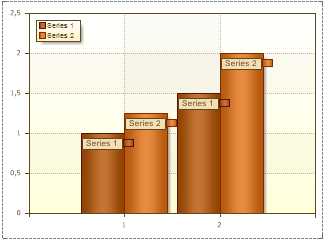

## MarkerAlignment Property

The **MarkerAlignment** property allows aligning a marker on the left or right of Series Labels. If the **MarkerAlignment** property is set to **Right**, then the marker is aligned to the left of Series Labels. The picture below shows the Markers aligned left:

If the **MarkerAlignment** property is set to **Right**, then the marker is aligned to the right of Series Labels. The picture below shows the Markers aligned right:

By default, the **MarkerAlignment** property is set to **Left**.
