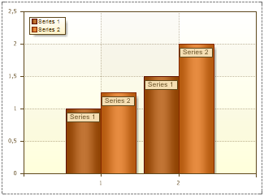
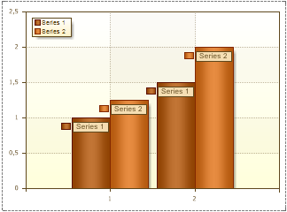

## MarkerVisible Property

If to set the MarkerVisible property to true then the Marker is shown. By default, the MarkerVisible property is set to false and Markers are not visible. The picture below shows a chart with the MarkerVisible property set to false:

The picture below shows a chart with the MarkerVisible property set to true:

