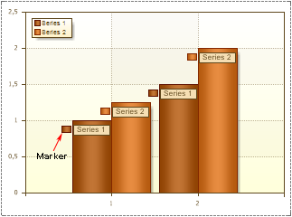

## Marker

**The** **Marker** is an icon that is shown near the Series Labels. It is possible to change height and width of the **Marker**. The **Marker** takes the color of Series. The picture below shows a chart with **Markers**:

