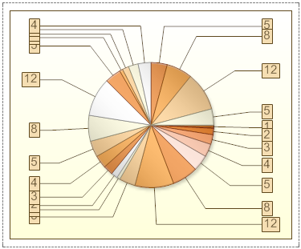
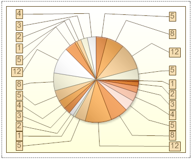

## PreventIntersection Property

The PreventIntersection property is used to avoid overlapping between series labels and with the borders of rendered values and axes. By default, the PreventIntersection property is set to false and series labels may overlap, what makes them look bad or unreadable. The picture below shows an example of a chart, with the PreventIntersection property set to false:

If the PreventIntersection property is set to true, then the series labels will not overlap. The picture below shows an example of a chart, with the PreventIntersection property set to true:

