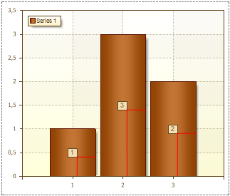

## Angle Property

The **Angle** property allows changing the inclination angle of Series Labels. By default, this property is set to **0** (Series Labels is not inclined). The picture below shows the situation when the **Angle** property is set to **0**:

The value of the property can be negative and positive. If a value of the property is negative then Series Label is inclined anticlockwise. If the value of the property is positive then Label in inclined clockwise. The picture below shows a chart sample, which the **Angle** property for Series Labels is set to **45**:

