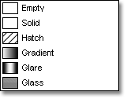
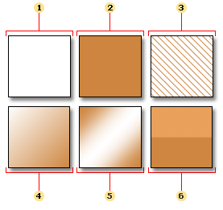
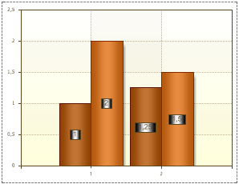

## Brush Property

The Brush property is used to fill a background type and color in Series Labels. To change the background color and appearance of a Series Label use the Brush property within the Object Inspector.

Six types of Brushes are available within Stimulsoft Reports:

 Empty

 Solid

 Hatch

 Gradient

 Glare

 Glass

Below are representations of the results all six Brush types:

 Empty. The background of a Series Label is transparent.

 Solid. The background of a Series Label is filled with the color you specify.

 Hatch. The background of a Series Label is filled with a texture. The background and foreground colors of the selected texture can be specified individually..

 Gradient. The background of a Series Label is filled with gradient. A Start color, an End color, and a Gradient angle can be specified.

 Glare. The background of a Series Label is filled using the Glare effect.

 Glass. The background of a Series Label is filled using the Glass effect.

The Brush.Color property is used to change the Series Labels color. The picture below shows a sample of a chart with the Brush property set to Glare:

