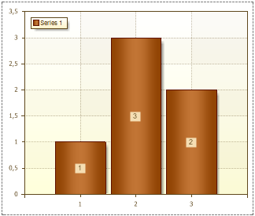

## DrawBorder Property

The DrawBorder property allows showing/hiding a border of Series Labels. It has two values: true and false. If the DrawBorder is set to true, then the border is shown. The picture below shows a chart with borders around Series Labels (the borders are red):

If the DrawBorder is set to false, then the border is hidden. The picture below shows a chart without borders around Series Labels:

