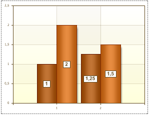

## Font Property

The font for Series Labels can be set using the Font property within the Object Inspector.

Selecting font

Series Labels within a report can be output using different fonts. Three examples fonts are shown below:

Any font that is installed on your machine can be used in Series Labels. However, when choosing a font try to select one that will also be present on a user machine or a report may not render as you would wish at runtime.

Font Size

The font size can be changed using the Font.Size property. For example:

Font Styles

Different styles can be applied to the font. A font may include one or more styles such as regular, bold, semibold, italic, underlined, and strikeout. Examples of font styles are shown below:

The picture below shows a chart with text set to Arial, Bold style, font size - 12:

