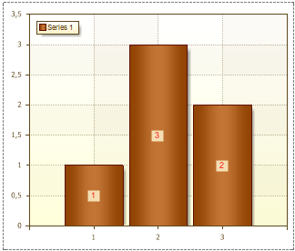

## LabelColor Property

The **Label Color** property within the Object Inspector is used to change the color of Series Labels. The picture below shows a chart with the **Label Color** property set to **red**:

