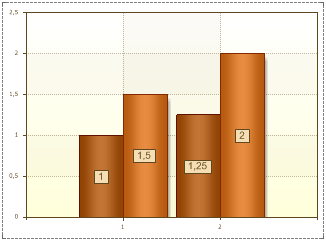

## UseSeriesColor Property

The UseSeriesColor property is used to make the border color and the series label color match to the color of the series. If the UseSeriesColor property is set to false, then the border color and the color of series labels will correspond to the selected values of the Border Color and Label Color properties. The picture below shows an example of a chart, with the UseSeriesColor property set to false:

If the UseSeriesColor property is set to true, then the border color and series labels color will match to the color of series. The picture below shows an example of a chart, with the UseSeriesColor property set to true:

