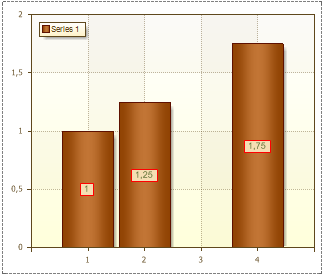

## ShowOnZeroValues Property

Sometimes, when designing charts, 0 values of series can be met. Series labels of zero values can be displayed. The ShowOnZeroValues property is used to show/hide these series labels. If the ShowOnZeroValues property is set to false, then series labels of zero values will be hidden. The picture below shows an example of a chart with a zero value and the the ShowOnZeroValues property is set to false:

In this chart the 3rd argument is 0, and the series labels is not displayed. If the ShowOnZeroValues property is set to true, then series labels of zero values will be shown.The picture below shows an example of a chart with a zero value and the the ShowOnZeroValues property is set to true:

As can be seen from this picture, the 3rd argument is 0, and its title was shown.
