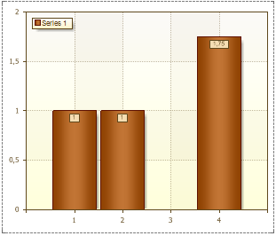
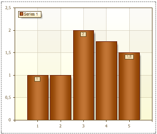

## Step Property

The **Step** property allows changing the step through what the Series Labels will be shown. By default, the **Step** property is set to **0**, so Series Labels will be shown on each Series. The picture below shows a chart with the **Step** property of Series Labels set to **0**:

If the **Step** property is set to **2**, then Series Labels will be shown as it is shown on picture below:

The value **1** of the **Step** property indicates that Series Labels will be shown for each value of Series.
