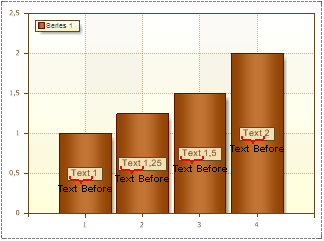
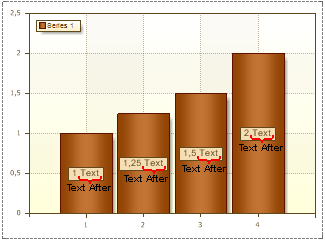

## TextBefore and TextAfter Properties

The TextBefore and TextAfter properties allow showing text before and after Series Labels. It is not necessary to use these properties. The pictures below show chart samples with a text before Series Labels (left) and a text after Series Labels (right):

