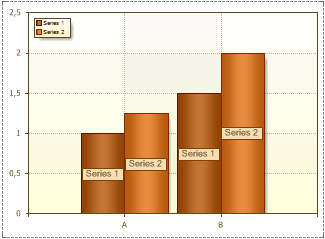
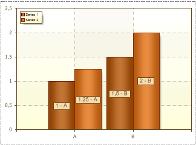
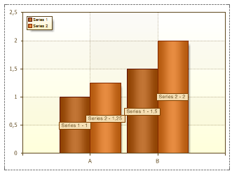

## ValueType Property

The **ValueType** property is used to specify the type of a value that appears in the series labels. This property may take the following values: **Value**, **Series Title**, **Argument**, **Value - Argument**, **Argument - Value**, **Series Title - Value**, **Series Title - Argument**.

* **Value**. The Series Labels are series values. The picture below shows an example of a chart with the **Value Type** property set to **Value**:

* **Series Title**. The Series Labels are records in the **Title** field in the **Series Editor**. The picture below shows an example of a chart with the **Value Type** property set to **Series Title**:

* **Argument**. The Series Labels are the arguments. The picture below shows an example of a chart with the **Value Type** property set to **Argument**:

* **Value - Argument**. The Series Labels are **Values** and **Arguments** of series. The picture below shows an example of a chart with the **Value Type** property set to **Value - Argument**:

* **Argument - Value**. The Series Labels are **Arguments** and **Values** of series. The picture below shows an example of a chart with the **Value Type** property set to **Argument - Value**:

* **Series Title - Value**. The Series Labels are **Series Titles** and **Values**. The picture below shows an example of a chart with the **Value Type** property set to **Series Title - Value**:

* **Series Title - Argument**. The Series Labels are **Series Titles** and **Arguments**. The picture below shows an example of a chart with the **Value Type** property set to **Series Title - Argument**:

