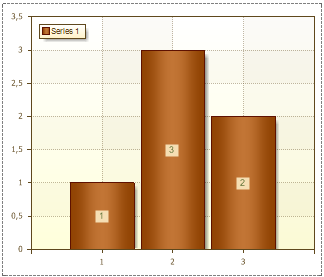
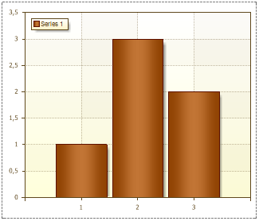

## Visible Property

The Visible property is used to show/hide Series Labels, depending on the selected value. If the Visible property is set to true, then Series Labels are shown. The picture below shows a chart with Series Labels:

If the Visible property is set to false, then Series Labels are not displayed. The picture below shows a chart with hidden Series Labels:

By default, the Visible property is set to true.
