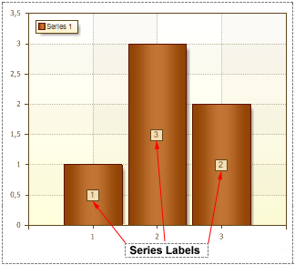

## Series Labels

**Series Labels** is an information block which displays the value of each series. The picture below shows an example of a chart, with Series Labels:

The **Series Labels** property is used to indicate position of series labels. The list of available options for this property depends on the type of chart. Also, the **Series Labels** property have some options that are used to change settings of Series Labels.
