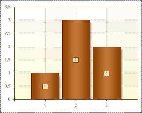
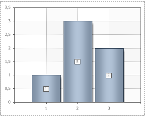

## Style

A style is a combination of various design attributes which can be applied to charts. The **Style** property is used to change the appearance of charts. The value of this property will be one of the chosen style diagrams. Adding custom styles to the list of the chart styles can be done using the **Style Designer**. Also, it is possible to apply a style to each series. When working with chart styles, it is necessary to take into account the value of the **AllowApplyStyle** property. The picture below shows an example of two charts with different styles:

