## Charts

> **YouTube**
>
> Check out our [video tutorials on creating reports with charts](https://www.youtube.com/watch?v=HBg6nqKizrI&list=PL6BCD8C9EBB9CB79E&index=2). Subscribe to the [Stimulsoft c](https://www.youtube.com/user/StimulsoftVideos)hannel to be the first to know about new tutorials. Leave your questions and suggestions in the video comments.

Chart is a data visualization tool used in a report. With this tool, data is processed, and the results are displayed using graphical elements.

The type of chart depends on the type of chart series. A single series represents the values of one data column, except in cases where multiple values are required to display graphical elements. For example, financial charts require four values to render a single graphical element.
Thus, a single Chart component can display multiple chart series. In this case, the series types are the same, but the data differs. However, some series types are compatible with others. For instance, a Histogram and a Line can be displayed within the same Chart component.

> **Information**
>
> The following series types are compatible with each other:
> * Histogram, Line, Spline, Step Line, Area, Spline Area, Step Area.
>
> * Stacked Histogram, Stacked Line, Stacked Spline, Stacked Area, Stacked Spline Area.
>
> * Normalized Histogram, Normalized Line, Normalized Spline, Normalized Area, Normalized Spline Area.

Chart series data can be:
* Obtained from data sources;
* Entered manually.

To add a Chart component to a report, follow these steps:
* In the Infographics menu on the toolbox or the Insert tab of the designer’s Ribbon panel, select a chart type.
* Click the desired location in the report with the left mouse button.

Next, resize the Chart component and configure it in the component editor. To open the Chart component editor:

* Double-click the Chart component in the report;
* Open the context menu of the Chart component and select the Design command.

Chart Editor
The chart and its elements are configured in the editor using properties. All properties are grouped on specific tabs based on the chart element they belong to. Additionally, properties within each tab are grouped by purpose, with each group represented as a separate section.

Each tab in the editor includes:
* A chart preview panel with property groups;
* A properties panel;
* Additionally, some tabs may display extra panels when selected.

All tabs and their property groups will be covered in the following sections:
* Chart;
* Series;

* Area;
* Labels;
* Styles.

The table below lists chart series types with brief descriptions.

Series

Description

Clustered Column:

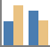

Clustered Column

Displays values for a specific argument. In histograms, graphical elements are arranged along the horizontal axis, while values are plotted on the vertical axis.

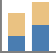

Stacked Column

Shows the proportion of values from different series for a specific argument. Each value represents a segment of the graphical element.

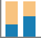

Full-Stacked Column

Displays the relative share of each value as a percentage of the total for a given argument.

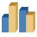

3D Clustered Column
A three-dimensional version of a standard histogram with data represented as 3D columns, highlighting categories on an additional axis.

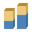

3D Stacked Column

Similar to a 3D Clustered Column but includes segments representing each category's contribution to the total.

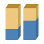

3D Full-Stacked Column

A stacked column normalized to 100%, showing proportions between categories.

Line:

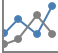

Line

Line and line with markers are used to indicate individual data values, line charts are useful to show trends over time or ordered categories, especially when there are many data points and the order in which they are presented is important.

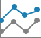

Stacked Line

Displayed with or without markers to indicate individual data values, stacked line charts are useful to show the trend of the contribution of each value over time or ordered categories. If there are many categories or the values are approximate, you should use a stacked line chart without markers.

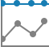

Full-Stacked Line

This is a kind of the Line series by which you can compare the relative proportion of each value of the series among the total aggregate value of specific arguments. Lines without markers are recommended in the approximation of the set of value arguments.

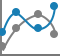

Spline

This type of series is used to display a smooth line, the points of which are the values of the series. Each point has its coordinates depending on the value and argument of the chart series. After all points are specified, a spline will be drawn. Points on the chart can be displayed using markers. Spline without markers is recommended in the approximation of the set of value arguments.

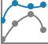

Stacked Spline

This type of series is used to display a smooth line, the points of which are the values ​​of the series. Each point has its coordinates depending on the value and argument of the chart series. The points of the next row of the chart are located above the smooth line of the previous row of the chart. After all points are specified, a stacked spline will be drawn. Points on the chart can be displayed using markers. Smooth lines without markers are recommended for the approximation of the set of value arguments.

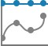

Full-Stacked Spline

This is a variety of Spline series, with which you can compare the relative proportion of each value of a series in the total aggregate value of specific arguments. Smooth lines without markers are recommended in the approximation of the set of value arguments.

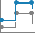

Stepped Line

This is a variation of the Line series, which will be displayed using only vertical and horizontal lines.

3D Line

A three-dimensional linear chart to analyze changes across three axes (X, Y, Z).

Pie:

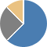

Pie

Pie charts display the contribution of each value to a total. It is possible to manually pull out the slices of a pie chart to emphasize them.

3D Pie

A 3D version of the pie chart displaying shares or percentages of data.

Doughnut

A doughnut chart is functionally similar to a pie chart, with the exception of a blank center and the ability to support multiple statistics as one.

Clustered Bar:

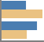

Clustered Bar

Clustered bar charts compares values across categories. In a clustered bar chart, the categories are typically organized along the vertical axis, and the values along the horizontal axis.

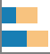

Stacked Bar

Shows proportions of values from different series for a specific argument.

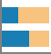

Full-Stacked Bar

Displays the relative share of each value as a percentage of the total for an argument.

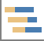

Gantt

Displays the duration of values over time.

Area:

Area

A variation of a line chart where the area under the line is filled.

Stacked Area

Displays proportions of areas for different series.

Full-Stacked Area

Shows relative proportions of areas as percentages.

Spline Area

A smooth line version of the area chart with a filled region.

Stacked Spline Area

Similar to Spline Area, with stacked regions for different series.

Full-Stacked Spline Area

Displays the relative share of smooth area series in a total.

Stepped Area

This is a type of linear series. In the chart area, points are marked by coordinates - the value and argument of the series. Then, strictly vertical and horizontal lines pass through these points. The area between the line and the axis of the arguments is filled with color.

Range:

Range

The chart type Range can be used to display the interval of values ​​per unit of time or period of time. To build such a diagram you should have start and end values​​.

Spline Range

The series of this type displays the interval of change of values by strictly vertical lines and the time interval by any smooth straight lines.

Stepped Range

A row of this type displays the interval of changing values by strictly vertical lines and a time interval by strictly horizontal lines.

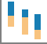

Range Bar

This type of series is used to display a range of values as columns for each argument. Also, if the chart has more than one row, it shows the ratio of the values of different rows for the current argument.

Scatter:

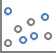

Scatter

Displays data as individual points on a coordinate plane, showing the relationship between two variables.

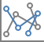

Scatter Line

Adds lines connecting the points, enabling the visualization of trends or data sequences.

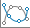

Scatter Spline

This type of chart can be displayed with or without a smooth curve connecting the data points. These lines can be displayed with or without markers. Use the scatter chart without markers if there are many data points.

Bubble
A series type is used to display three-dimensional data in two-dimensional space. In addition to the coordinates for each bubble, the value of its width or weight is indicated.

Radar:

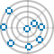

Radar Point
This series is used to display three-dimensional data in two-dimensional space using points on a circular area.

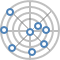

Radar Line
This series is used to display three-dimensional data in two-dimensional space, using points and lines between them, on a circular area.

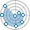

Radar Area

This series is used to display three-dimensional data in two-dimensional space, using points and lines that form a region, on a circular region.

Funnel:

Funnel

This type of series is used to display statistical data, for example, sales stats and attendance of an online store. Depending on the value, the width of the parts of the graphic element will change.

Funnel Weighted Slices

This type of series is used to display statistical data, for example, stats by sales and attendance of an online store. The graphic element will always be in displayed as a funnel, where every part is a separate value. Depending on the value, the height of the parts of the graphic element will change.

Financial:

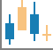

Candlestick

The financial series, using which you can display stock indicators of stocks, currencies, precious metals, etc.

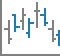

Stock

Another series for the financial chart, which displays market trends.

Treemap:

Treemap
A series is used to display a hierarchy of values. The chart area is the sum of all major values. This area will be split proportionally for each value of the first row. In turn, this each part will be divided into proportional parts for each value of the second row, etc.

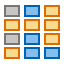

Heatmap

Uses a color gradient to represent values in a table format. Useful for density or distribution analysis.

Histogram:

Histogram

Displays data distribution with vertical bars representing value frequency.

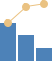

Pareto
Applies Pareto’s principle to values.

Ribbon

Represents data with horizontal ribbons for easy comparison.

Pictorial:

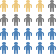

Pictorial
A series type that is used to display data as special set of icons.

Pictorial Stacked

Icons show total values with stacking for categories.

Other:

Sunburst

A hierarchical circular chart with nested data.

Box and Whisker

Displays data distribution with quartiles, median, and outliers.

Waterfall

Shows cumulative totals by adding or subtracting values.
