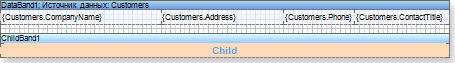
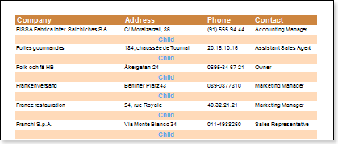

## Child Band and Data

How to output two bands on one data row? You can use the **Child** band. Create a new report. Put the **Data** band on a page. Put the **Child** band under the **Data** band.

Run a report for execution. As you can see, the **Child** band was printed as many times as the **Data** band. The **Child** band is a continuation of the **Data** band. But at the same time it remained to be a band, with all its properties.

The **Child** band can be used not only with the **Data** band. It can be placed after any band on a page. For example, after the **Header** band or after the **Group Header** band.

* The **Child** band can be used in association with any band.
