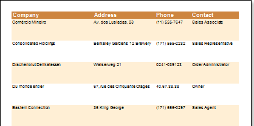
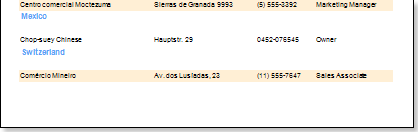
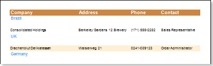
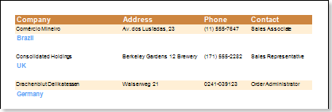

## KeepChildTogether Property

For example, add the Child band to the Data band, as the result a data row and an empty row (Child band row) is output, visually it looks like a high line.

Add data to the Child band, for example Country.

The picture below shows that instead of empty space, the country name will be output.

So as to avoid breaking data, meaning when Company, Address, Phone, Contact remained on one page, and the second part (in our case, Country) was moved to another page, the Child band has the KeepChildTogether property.

By default the property is set to true.
