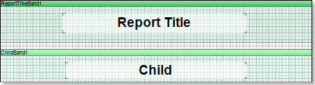
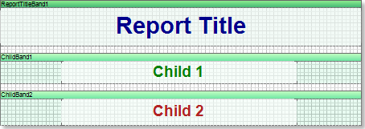
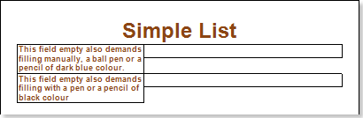
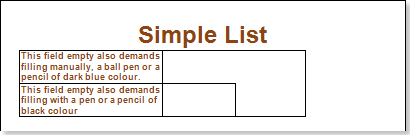
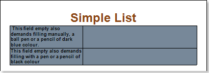
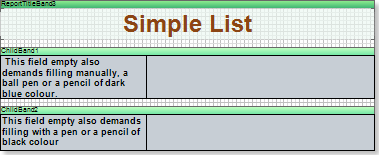

## Multi Line Header

The **Child** band is a band that is a continuation of the band, after which it is placed.

In the picture above shows the **Child** band is placed after the **Report Title** band, respectively, it is a continuation of this **Report Title** band. There are no limitations on the number of **Child** bands placed on a page.

The picture above shows two **Child** band, which are a continuation of the **Report Title** band. Suppose there is a report with the report title that consists of a few lines. If the text is placed on the **Report Title** band, then visually it may look not entirely correct:

Even when using the **GrowToHeight** property, then visually it cannot be convenient:

Therefore, in some cases, the title of the report is better represent with the **Child** band:

The picture below shows the report title located in the **ReportTitle** band and two **Child** band.

