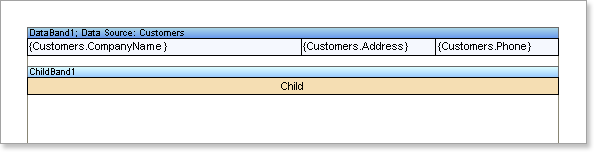
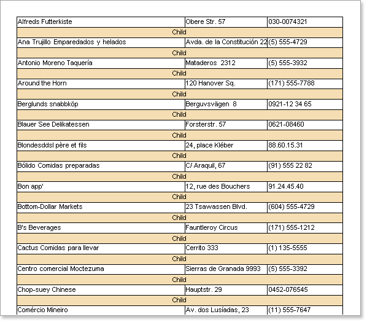

## Child Band

The **Child** band can be used in tandem with other bands. It can be placed after any band on a page, including after the Header band or the Group Header band.  It allows the parent band to be effectively extended whilst the child can behave differently, for example having a different background color.

* **Note:** The **Child** band can be used in combination with any other bands placed on a page.

**Using The Child Band With Data Bands**

The Child band allows you to output two bands on one data row. To use the child band in this way you would create a new report, put a Data band on the page, and then put a Child band after the Data band.

When you run the report the Child band will be printed as many times as the Data band. In other words the **Child** band acts as a continuation of the Data band but is still a band in its own right possessing all properties available with other bands.

